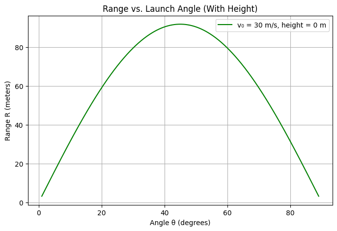
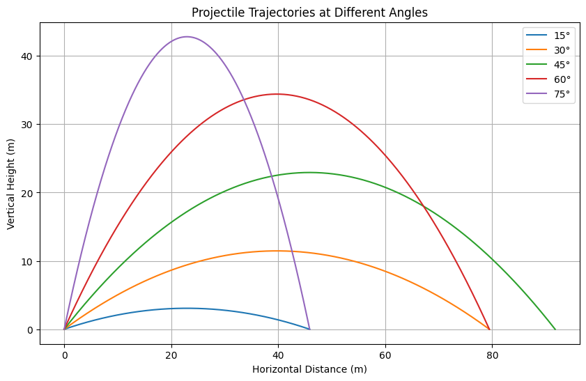

# 1. Theoretical Foundation

## 1.1 Introduction

Projectile motion is governed by Newton's laws of motion under the influence of a constant gravitational field. In this section, we derive the parametric equations for projectile motion, and express the key characteristics — **time of flight**, **horizontal range**, and **maximum height** — in terms of:

- Initial velocity $v_0$
- Projection angle $\theta$
- Gravitational acceleration $g$
- Launch height $h$ (optional)

We assume the absence of air resistance and a flat horizontal surface unless otherwise stated.

---

## 1.2 Deriving the Equations of Motion

We decompose the initial velocity $v_0$ into horizontal and vertical components:

- Horizontal: $v_{0x} = v_0 \cos \theta$
- Vertical: $v_{0y} = v_0 \sin \theta$

Assuming acceleration due to gravity acts only vertically, the kinematic equations are:

### Horizontal Motion:
$$
x(t) = v_0 \cos \theta \cdot t
$$

### Vertical Motion:
$$
y(t) = h + v_0 \sin \theta \cdot t - \frac{1}{2} g t^2
$$

These parametric equations describe the complete trajectory:
- $x(t)$: Horizontal displacement at time $t$
- $y(t)$: Vertical displacement at time $t$

---

## 1.3 Time of Flight (T)

### Case A: Launched from Ground ($h = 0$)

The projectile lands when $y(T) = 0$. Solve:
$$
0 = v_0 \sin \theta \cdot T - \frac{1}{2} g T^2
$$

Factoring out $T$:
$$
T \left( v_0 \sin \theta - \frac{1}{2} g T \right) = 0
$$

Ignoring the trivial solution $T = 0$, we get:
$$
T = \frac{2 v_0 \sin \theta}{g}
$$

### Case B: Launched from Height $h > 0$

Solve $y(T) = 0$:
$$
0 = h + v_0 \sin \theta \cdot T - \frac{1}{2} g T^2
$$

This is a quadratic in $T$:
$$
\frac{1}{2} g T^2 - v_0 \sin \theta \cdot T - h = 0
$$

Solving:
$$
T = \frac{v_0 \sin \theta + \sqrt{(v_0 \sin \theta)^2 + 2 g h}}{g}
$$

(Only the positive root is physically valid.)

---

## 1.4 Horizontal Range (R)

The horizontal range is the total horizontal distance traveled before the projectile lands:

$$
R = x(T) = v_0 \cos \theta \cdot T
$$

Using the time of flight expressions above:

### If $h = 0$:
$$
R = v_0 \cos \theta \cdot \frac{2 v_0 \sin \theta}{g} = \frac{v_0^2 \sin(2\theta)}{g}
$$

This range is maximized when $\sin(2\theta)$ is maximal, i.e., when $2\theta = 90^\circ \Rightarrow \theta = 45^\circ$.

### If $h > 0$:
Use:
$$
R = v_0 \cos \theta \cdot \left( \frac{v_0 \sin \theta + \sqrt{(v_0 \sin \theta)^2 + 2 g h}}{g} \right)
$$

---

## 1.5 Maximum Height ($H$)

The projectile reaches its maximum height when the vertical velocity becomes zero:

$$
v_y(t_H) = 0 = v_0 \sin \theta - g t_H
$$

Solving for time to reach maximum height:
$$
t_H = \frac{v_0 \sin \theta}{g}
$$

Substitute into $y(t)$:
$$
H = h + v_0 \sin \theta \cdot \frac{v_0 \sin \theta}{g} - \frac{1}{2} g \left( \frac{v_0 \sin \theta}{g} \right)^2
$$

Simplifies to:
$$
H = h + \frac{(v_0 \sin \theta)^2}{2g}
$$

---

## 1.6 Assumptions

To derive these equations, we made the following assumptions:

1. The gravitational field is uniform: $g = 9.81 \ \text{m/s}^2$.
2. The projectile is treated as a point mass.
3. Air resistance is negligible.
4. The launch and landing surfaces are horizontal and level (unless otherwise stated).
5. The Earth's curvature and rotation are ignored (reasonable for short distances).

---

# 2. Analysis of the Range

## 2.1 Definition

The **range** $R$ of a projectile is defined as the **horizontal distance** traveled between the launch point and the point of impact (where the projectile returns to the same vertical level, or hits the ground). The range is a function of several parameters:

- Initial velocity: $v_0$
- Projection angle: $\theta$
- Gravitational acceleration: $g$
- Launch height: $h$

We express $R$ as a function of the angle $\theta$ under two scenarios:

---

## 2.2 Launch from Ground Level ($h = 0$)

From the theoretical derivation:

- Time of flight:
  $$
  T = \frac{2 v_0 \sin \theta}{g}
  $$

- Horizontal velocity: $v_0 \cos \theta$

Thus, the horizontal range is:
$$
R(\theta) = v_0 \cos \theta \cdot \frac{2 v_0 \sin \theta}{g}
= \frac{v_0^2 \sin(2\theta)}{g}
$$

### Observations:

- The range is **maximum** when $\sin(2\theta) = 1$, which occurs at:
  $$
  \theta = 45^\circ
  $$

- The function $\sin(2\theta)$ is **symmetric** about $\theta = 45^\circ$:
  $$
  R(30^\circ) = R(60^\circ), \quad R(20^\circ) = R(70^\circ)
  $$

- $R(\theta)$ is a **trigonometric function** bounded by:
  $$
  0 \leq R(\theta) \leq \frac{v_0^2}{g}
  $$

---

## 2.3 Launch from a Height ($h > 0$)

The time of flight becomes:
$$
T = \frac{v_0 \sin \theta + \sqrt{(v_0 \sin \theta)^2 + 2 g h}}{g}
$$

Thus, the range is:
$$
R(\theta) = v_0 \cos \theta \cdot \left( \frac{v_0 \sin \theta + \sqrt{(v_0 \sin \theta)^2 + 2 g h}}{g} \right)
$$

### Key Insights:

- The expression is **no longer symmetric** about $45^\circ$.
- As $h$ increases, the projectile stays in the air longer, increasing the range.
- The angle for maximum range is **less than $45^\circ$** when launched from height.

---

## 2.4 Factors Influencing the Range

### 1. **Initial Velocity ($v_0$)**

- Range is **quadratic** in $v_0$:
  $$
  R \propto v_0^2
  $$
- Doubling $v_0$ **quadruples** the range (all else equal).

### 2. **Gravitational Acceleration ($g$)**

- Range is **inversely proportional** to $g$:
  $$
  R \propto \frac{1}{g}
  $$
- Projectiles travel farther on the Moon (lower $g$), and shorter on Jupiter (higher $g$).

### 3. **Projection Angle ($\theta$)**

- For ground-level launch:
  $$
  R(\theta) = \frac{v_0^2 \sin(2\theta)}{g}
  $$
- $R$ increases with $\theta$ up to $45^\circ$, then decreases.

### 4. **Launch Height ($h$)**

- Higher $h$ → longer flight time → greater range.
- The angle that maximizes range **shifts lower** as $h$ increases.
- There is no simple analytical angle that maximizes range in this case — it must be found numerically.

---

## 2.5 Summary

- **At ground level**, $R(\theta)$ is maximized at $\theta = 45^\circ$.
- **With launch height**, maximum range occurs at $\theta < 45^\circ$.
- Range is sensitive to changes in $v_0$ and $h$, and inversely sensitive to $g$.
- Real-world applications must consider terrain, air resistance, and spin for accurate modeling.

# 🌍 3. Practical Applications

## 3.1 Real-World Examples of Projectile Motion

Projectile motion models are widely used to analyze and predict the behavior of objects launched through the air. Although idealized, the core concepts apply across multiple fields:

### ⚽ Sports
- **Football**: Calculating the arc of a long-range shot or optimizing a throw-in angle.
- **Basketball**: Predicting whether a jump shot will go in, based on release angle and velocity.
- **Golf**: Determining launch angles and spin for maximum driving distance.

### 🪖 Artillery & Military
- **Projectile Trajectories**: A fundamental component in the design and deployment of rockets, mortars, and ballistic missiles.
- **Targeting Algorithms**: Simplified models used in early targeting, later refined with correction factors.

### ⛲ Civil & Mechanical Engineering
- **Water Fountains**: Designing jets to achieve desired arcs and reach.
- **Fire Hose Streams**: Ensuring water reaches upper floors or targets accurately.

### 🌌 Space and Astrophysics
- **Planetary Landings**: Parabolic descent approximations are used during initial planning phases.
- **Escape Velocities**: Initial modeling assumes projectile-style motion before introducing orbital dynamics.

---

## 3.2 Limitations of the Basic Model

The idealized equations of projectile motion assume:

- Constant gravitational acceleration ($g$)
- No air resistance
- Flat, horizontal ground
- No rotation or curvature of the Earth
- Point-mass particles (no size or spin)

These assumptions limit the accuracy of predictions in real scenarios. Here are the main **factors not considered** in the basic model:

---

## 3.3 Additional Real-World Factors

### 1. 🌀 Air Resistance (Drag)

Air resistance opposes the direction of motion and increases with velocity. Its presence results in:

- **Shorter range**: The projectile loses kinetic energy over time.
- **Asymmetrical trajectory**: The descent is steeper than the ascent.
- **Terminal velocity**: For downward motion, objects stop accelerating eventually.

The drag force can be modeled as:
$$
F_d = \frac{1}{2} C_d \rho A v^2
$$

Where:
- $C_d$: Drag coefficient
- $\rho$: Air density
- $A$: Cross-sectional area
- $v$: Instantaneous velocity

Including air resistance requires solving a system of coupled nonlinear differential equations.

---

### 2. 🌬️ Wind

Wind can alter the projectile path significantly:
- **Headwind** reduces range
- **Tailwind** increases range
- **Crosswind** introduces lateral deflection

Wind must be modeled as an external velocity vector affecting the relative airspeed of the projectile.

---

### 3. 🏔️ Inclined or Curved Terrain

Flat ground assumption fails in:
- Mountainous terrain
- Urban environments
- Ramps and inclined launch pads

When the landing surface is inclined at an angle $\phi$, the effective range becomes geometry-dependent:
$$
R_{\text{inclined}} = \frac{v_0^2 \sin(2(\theta - \phi))}{g \cos^2 \phi}
$$

Curved surfaces require even more complex treatment, often using polar or spherical coordinate systems.

---

### 4. 🧭 Earth's Rotation (Coriolis Effect)

For long-range projectiles (e.g., intercontinental artillery or rockets):
- The **Coriolis force** due to Earth’s rotation deflects trajectories.
- Significant in **military** and **aerospace** engineering.

---

## 3.4 Summary

| Factor            | Effect on Motion                   | Requires Complex Modeling? |
|-------------------|------------------------------------|-----------------------------|
| Air Resistance     | Reduces range, changes trajectory  | ✅ Yes                       |
| Wind               | Alters path, may drift laterally   | ✅ Yes                       |
| Terrain Geometry   | Affects landing height and distance| ✅ Yes                       |
| Earth's Rotation   | Causes trajectory deviation        | ✅ Yes                       |

While the basic projectile model provides a strong foundation, accurate prediction and engineering design require extending the model to account for these factors through numerical methods or simulation.


```python
# ✅ Imports
import numpy as np
import matplotlib.pyplot as plt
from math import radians, sin, cos, sqrt
from ipywidgets import interact
import warnings
warnings.filterwarnings('ignore')

# ✅ Core Functions
def compute_range(v0, theta_deg, g=9.81):
    theta_rad = np.radians(theta_deg)
    return (v0**2 * np.sin(2 * theta_rad)) / g

def compute_range_with_height(v0, theta_deg, h, g=9.81):
    theta_rad = radians(theta_deg)
    vy = v0 * sin(theta_rad)
    vx = v0 * cos(theta_rad)
    discriminant = vy**2 + 2 * g * h
    if discriminant < 0:
        return 0
    t_total = (vy + sqrt(discriminant)) / g
    return vx * t_total

# ✅ Plot: Range vs. Angle (Ground Level)
def plot_range_vs_angle(v0, g=9.81):
    angles = np.linspace(0, 90, 500)
    ranges = [compute_range(v0, theta, g) for theta in angles]

    plt.figure(figsize=(8, 5))
    plt.plot(angles, ranges, label=f"v₀ = {v0} m/s")
    plt.title("Range vs. Launch Angle (Ground Level)")
    plt.xlabel("Angle θ (degrees)")
    plt.ylabel("Range R (meters)")
    plt.grid(True)
    plt.legend()
    plt.show()

# ✅ Plot: Range vs. Angle (With Height)
def plot_range_vs_angle_with_height(v0, h, g=9.81):
    angles = np.linspace(1, 89, 500)
    ranges = [compute_range_with_height(v0, theta, h, g) for theta in angles]

    plt.figure(figsize=(8, 5))
    plt.plot(angles, ranges, color='green', label=f"v₀ = {v0} m/s, height = {h} m")
    plt.title("Range vs. Launch Angle (With Height)")
    plt.xlabel("Angle θ (degrees)")
    plt.ylabel("Range R (meters)")
    plt.grid(True)
    plt.legend()
    plt.show()

# ✅ Plot: Multiple Trajectories
def plot_trajectories(v0, h=0, g=9.81, angles_deg=[15, 30, 45, 60, 75]):
    plt.figure(figsize=(10, 6))
    for angle in angles_deg:
        theta = radians(angle)
        vx = v0 * cos(theta)
        vy = v0 * sin(theta)
        discriminant = vy**2 + 2 * g * h
        if discriminant < 0:
            continue
        t_flight = (vy + sqrt(discriminant)) / g
        t = np.linspace(0, t_flight, 500)
        x = vx * t
        y = h + vy * t - 0.5 * g * t**2
        plt.plot(x, y, label=f"{angle}°")

    plt.title("Projectile Trajectories at Different Angles")
    plt.xlabel("Horizontal Distance (m)")
    plt.ylabel("Vertical Height (m)")
    plt.grid(True)
    plt.legend()
    plt.show()

# ✅ Interactive Dashboard (Colab-compatible)
@interact(v0=(10, 100, 5), h=(0, 50, 1), g=(5.0, 20.0, 0.1))
def update(v0=30, h=0, g=9.81):
    plot_range_vs_angle(v0, g)
    plot_range_vs_angle_with_height(v0, h, g)
    plot_trajectories(v0, h, g)
```



