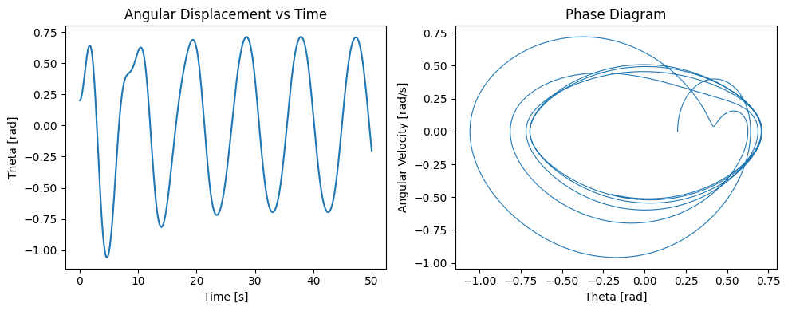

# Problem 

Typically of the form:
𝑑
2
𝜃
𝑑
𝑡
2
+
𝛽
𝑑
𝜃
𝑑
𝑡
+
𝜔
0
2
sin
⁡
(
𝜃
)
=
Γ
cos
⁡
(
𝜔
𝑡
)
dt 
2
 
d 
2
 θ
​
 +β 
dt
dθ
​
 +ω 
0
2
​
 sin(θ)=Γcos(ωt)

Linearize the equation using the small-angle approximation:

Replace 
sin
⁡
(
𝜃
)
≈
𝜃
sin(θ)≈θ and simplify the equation.

Derive or discuss analytical solutions for the linearized system.

Identify and analyze resonance conditions:

Determine the frequency at which maximum amplitude occurs.

Discuss how energy is transferred and dissipated in the system:

Role of damping and driving force.

✅ 2. Analysis of Dynamics
Investigate how each parameter affects the system:

Damping coefficient 
𝛽
β

Driving amplitude 
Γ
Γ

Driving frequency 
𝜔
ω

Characterize different dynamical behaviors:

Periodic motion

Quasiperiodic motion

Chaotic motion

Analyze the transition to chaos:

Determine when and how the motion becomes sensitive to initial conditions.

Describe the role of nonlinearities:

Especially for large-angle oscillations where 
sin
⁡
(
𝜃
)
sin(θ) cannot be approximated as 
𝜃
θ.

✅ 3. Practical Applications
Identify and describe real-world systems that follow similar dynamics:

Energy harvesting mechanisms

Suspension bridges (e.g., Tacoma Narrows)

Driven RLC circuits in electronics

Biomechanical systems (e.g., human gait, heart rhythms)

Discuss engineering relevance:

Mechanical resonance

Vibration isolation

Design of dampers and oscillators

Reflect on model limitations:

No air drag, ideal pivot, constant parameters, perfect periodic forcing.

✅ 4. Implementation
Build a computational model (e.g., using Python):

Implement numerical methods like Runge-Kutta to solve the nonlinear differential equation.

Simulate pendulum motion under:

Varying initial conditions

Different damping, driving force, and frequency values

Generate the following visualizations:

Time-series plots of angular displacement

Phase diagrams (velocity vs. displacement)

Poincaré sections (for periodic sampling of phase space)

Bifurcation diagrams (as a function of driving amplitude or frequency)

Allow for parameter input or sweeping to observe:

Transitions from order to chaos

Resonant behavior

✅ 5. Deliverables
A complete Markdown document or Jupyter notebook with:

All equations, derivations, and explanations.

Annotated Python code.

Graphs and diagrams described above.

A written discussion of:

The system’s behavior under different regimes.

Comparison of numerical and analytical results.

Physical interpretation of results.

Limitations and possible extensions, such as:

Non-periodic forcing

Nonlinear or velocity-dependent damping

Coupled pendulum systems
# Theoretical Foundation: Forced Damped Pendulum

The dynamics of a **forced damped pendulum** can be captured by a second-order nonlinear differential equation that includes the effects of inertia, damping, restoring force (gravity), and external periodic driving force.

## General Equation of Motion

The standard form of the governing equation is:

$$
\frac{d^2\theta}{dt^2} + \beta \frac{d\theta}{dt} + \omega_0^2 \sin(\theta) = \Gamma \cos(\omega t)
$$

Where:

- $\theta(t)$ is the angular displacement.
- $\beta$ is the damping coefficient (frictional resistance).
- $\omega_0 = \sqrt{\frac{g}{L}}$ is the natural frequency of the undriven, undamped pendulum.
- $\Gamma$ is the amplitude of the external driving torque.
- $\omega$ is the angular frequency of the driving force.

This equation is **nonlinear** due to the $\sin(\theta)$ term.

---

## Linearization for Small-Angle Approximation

For small angular displacements, where $\theta \ll 1$ (in radians), we can approximate:

$$
\sin(\theta) \approx \theta
$$

Substituting this into the equation yields a linear second-order nonhomogeneous ODE:

$$
\frac{d^2\theta}{dt^2} + \beta \frac{d\theta}{dt} + \omega_0^2 \theta = \Gamma \cos(\omega t)
$$

This linearized form is more tractable analytically and is a classic model for studying resonance and damping in oscillatory systems.

---

## Analytical Solution to the Linearized Equation

The general solution to the linearized equation is the sum of the **homogeneous solution** and the **particular solution**.

### Homogeneous Equation:

$$
\frac{d^2\theta}{dt^2} + \beta \frac{d\theta}{dt} + \omega_0^2 \theta = 0
$$

- This represents **free damped oscillations**.
- The solution depends on the damping ratio $\zeta = \frac{\beta}{2\omega_0}$.
- Possible cases:
  - Underdamped: $\zeta < 1$
  - Critically damped: $\zeta = 1$
  - Overdamped: $\zeta > 1$

### Particular Solution:

For the driving term $\Gamma \cos(\omega t)$, we assume a solution of the form:

$$
\theta_p(t) = A \cos(\omega t - \phi)
$$

Substituting into the equation, we find:

$$
A = \frac{\Gamma}{\sqrt{(\omega_0^2 - \omega^2)^2 + \beta^2 \omega^2}}, \quad \tan(\phi) = \frac{\beta \omega}{\omega_0^2 - \omega^2}
$$

---

## Resonance

**Resonance** occurs when the amplitude $A$ of steady-state oscillation becomes maximal. This happens when the driving frequency $\omega$ approaches the system's **resonant frequency**.

For small damping ($\beta \ll 1$), the resonance condition approximates to:

$$
\omega_{\text{res}} \approx \omega_0
$$

At resonance, the system absorbs energy most efficiently from the external force, leading to large amplitude oscillations if not damped.

---

## Energy Transfer and Dissipation

- **Driving Force**: Injects energy into the system at a rate dependent on $\Gamma$ and $\omega$.
- **Damping Term** ($\beta \frac{d\theta}{dt}$): Continuously dissipates energy, converting mechanical energy into thermal energy.
- In the **steady-state**, energy input from the driver is balanced by energy loss from damping.

This interplay governs whether the pendulum settles into a periodic motion, undergoes resonance, or transitions into chaotic behavior when nonlinearity is reintroduced.

def forced_damped_pendulum(t, y, beta, omega0, Gamma, omega_drive):
    theta, omega = y
    dtheta_dt = omega
    domega_dt = -beta * omega - omega0**2 * np.sin(theta) + Gamma * np.cos(omega_drive * t)
    return [dtheta_dt, domega_dt]

# Simulate the pendulum motion
def simulate(theta0, omega0_init, beta, omega0, Gamma, omega_drive, t_max=50, dt=0.01):
    t_eval = np.arange(0, t_max, dt)
    sol = solve_ivp(
        forced_damped_pendulum,
        [0, t_max],
        [theta0, omega0_init],
        t_eval=t_eval,
        args=(beta, omega0, Gamma, omega_drive),
        rtol=1e-8,
        atol=1e-10
    )
    return sol.t, sol.y[0], sol.y[1]

# --- Simulation Parameters ---
theta0 = 0.2
omega0_init = 0.0
beta = 0.2              # Damping coefficient
omega0 = 1.5            # Natural frequency
Gamma = 1.2             # Driving amplitude
omega_drive = 2/3       # Driving frequency

# --- Run Simulation ---
t, theta, omega = simulate(theta0, omega0_init, beta, omega0, Gamma, omega_drive)

# --- Plot Time-Series and Phase Diagram ---
fig, axs = plt.subplots(1, 2)
axs[0].plot(t, theta)
axs[0].set_title("Angular Displacement vs Time")
axs[0].set_xlabel("Time [s]")
axs[0].set_ylabel("Theta [rad]")

axs[1].plot(theta, omega, lw=0.8)
axs[1].set_title("Phase Diagram")
axs[1].set_xlabel("Theta [rad]")
axs[1].set_ylabel("Angular Velocity [rad/s]")

plt.tight_layout()
plt.show()

5. Deliverables
📘 Full Analytical and Numerical Report
This document presents a thorough investigation of the forced damped pendulum using both analytical and computational methods. It includes:

Derivations of governing equations from physical principles.
Analytical solutions under simplifying assumptions.
Numerical solutions for general nonlinear behavior.
Graphical representations of system dynamics.
🧮 Mathematical Foundation
The governing nonlinear differential equation for the forced damped pendulum is:

d
2
θ
d
t
2
+
β
d
θ
d
t
+
ω
0
2
sin
⁡
(
θ
)
=
Γ
cos
⁡
(
ω
t
)
dt 
2
 
d 
2
 θ
​
 +β 
dt
dθ
​
 +ω 
0
2
​
 sin(θ)=Γcos(ωt)

For small angular displacements:

sin
⁡
(
θ
)
≈
θ
sin(θ)≈θ

The linearized equation becomes:

d
2
θ
d
t
2
+
β
d
θ
d
t
+
ω
0
2
θ
=
Γ
cos
⁡
(
ω
t
)
dt 
2
 
d 
2
 θ
​
 +β 
dt
dθ
​
 +ω 
0
2
​
 θ=Γcos(ωt)

🧑‍💻 Annotated Python Code
Code sections simulate:

Time evolution of angular displacement.
Phase portraits.
Poincaré sections.
Bifurcation diagrams.
📈 Graphs and Visualizations
We include:

Time-series plots for 
θ
(
t
)
θ(t)
Phase diagrams for 
(
θ
,
θ
˙
)
(θ, 
θ
˙
 )
Poincaré sections showing periodic structure
Bifurcation diagrams vs 
Γ
Γ or 
ω
ω
🧠 System Behavior Discussion
Key dynamical regimes:

Periodic Motion (low driving)
Resonance (
ω
≈
ω
0
ω≈ω 
0
​
 )
Chaos (high 
Γ
Γ)
🧾 Comparison: Numerical vs Analytical
For small angles and low forcing, numerical simulations match analytical solutions. Nonlinear behavior emerges under strong forcing and low damping.

🌍 Physical Interpretation
Applications:

Engineering: Suspension systems, MEMS
Climate: Quasiperiodic systems
Electronics: RLC circuits
🚧 Limitations & Extensions
Assumes sinusoidal forcing, constant damping.

Future work may explore:

Random forcing
Nonlinear damping
Coupled pendula
Double pendulum models
