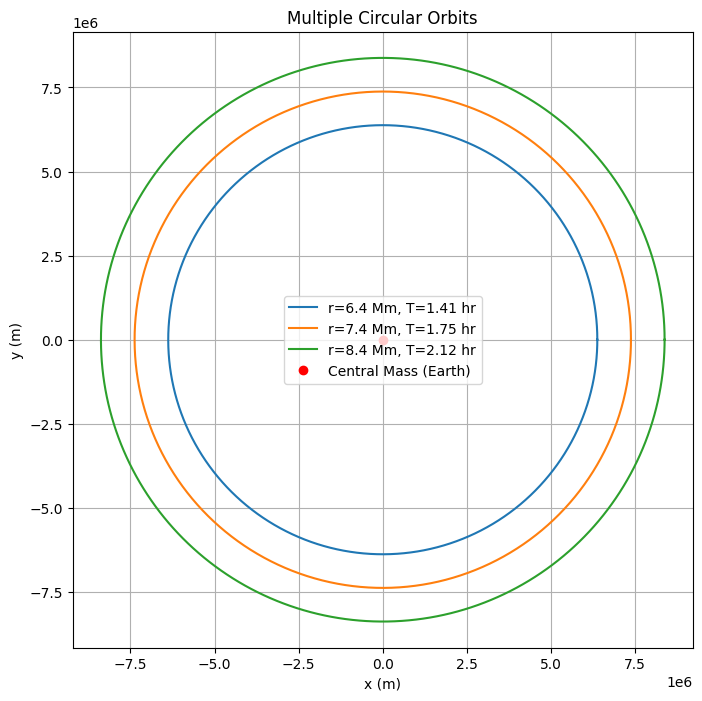
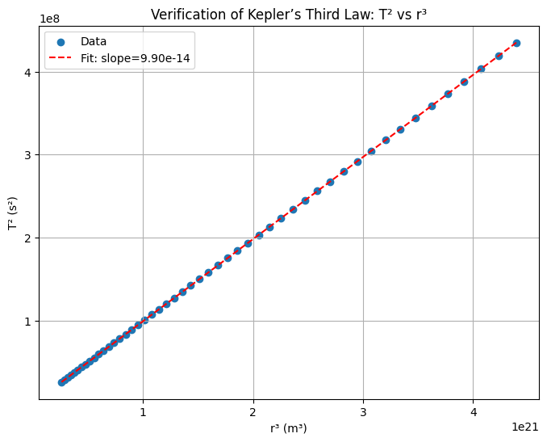

# Problem 1
Academic Notes on Kepler's Third Law for Circular Orbits

Derivation of Kepler's Third Law for Circular Orbits

To derive the relationship between the square of the orbital period ($T^2$) and the cube of the orbital radius ($r^3$) for a body in circular orbit, we rely on the principles of gravitational and centripetal forces. Consider a satellite of mass $m$ orbiting a central body of mass $M$ (e.g., a planet or star) in a circular orbit with radius $r$. The gravitational force provides the necessary centripetal force to maintain the circular motion.

Step 1: Gravitational Force

The gravitational force between the satellite and the central body, according to Newton's law of universal gravitation, is given by: $$ F_g = \frac{G M m}{r^2}, $$ where $G$ is the gravitational constant ($G \approx 6.674 \times 10^{-11} , \text{m}^3 \text{kg}^{-1} \text{s}^{-2}$), $M$ is the mass of the central body, $m$ is the mass of the satellite, and $r$ is the orbital radius.

Step 2: Centripetal Force

For a circular orbit, the satellite moves with constant speed $v$ along a circular path, requiring a centripetal force directed toward the center of the orbit. The centripetal force is: $$ F_c = \frac{m v^2}{r}, $$ where $v$ is the orbital velocity.

Step 3: Equating Forces

Since the gravitational force provides the centripetal force, we equate the two: $$ \frac{G M m}{r^2} = \frac{m v^2}{r}. $$ The mass $m$ of the satellite cancels out (assuming $m \neq 0$), yielding: $$ \frac{G M}{r^2} = \frac{v^2}{r}. $$ Multiplying both sides by $r$, we obtain: $$ \frac{G M}{r} = v^2. $$

Step 4: Orbital Velocity and Period

The orbital velocity $v$ is related to the orbital period $T$, the time taken to complete one full orbit. The circumference of the circular orbit is $2 \pi r$, so the velocity is: $$ v = \frac{2 \pi r}{T}. $$ Squaring this, we get: $$ v^2 = \frac{4 \pi^2 r^2}{T^2}. $$

Step 5: Substitute and Simplify

Substitute $v^2 = \frac{4 \pi^2 r^2}{T^2}$ into the force balance equation: $$ \frac{G M}{r} = \frac{4 \pi^2 r^2}{T^2}. $$ Multiply both sides by $T^2$: $$ \frac{G M T^2}{r} = 4 \pi^2 r^2. $$ Divide through by $r$ to isolate terms: $$ G M T^2 = 4 \pi^2 r^3. $$ Rearrange to express Kepler's Third Law: $$ T^2 = \frac{4 \pi^2}{G M} r^3. $$ This shows that the square of the orbital period ($T^2$) is proportional to the cube of the orbital radius ($r^3$), with the constant of proportionality $\frac{4 \pi^2}{G M}$, which depends on the mass of the central body and the gravitational constant.

Key Assumptions

The orbit is circular, ensuring constant $r$ and $v$.

The mass of the satellite $m$ is much smaller than $M$, so the central body's motion is negligible.

The gravitational constant $G$ and central mass $M$ are treated as constants.

Implications for Astronomy

Kepler's Third Law, expressed as $T^2 = \frac{4 \pi^2}{G M} r^3$, has profound applications in astronomy, enabling the study of celestial mechanics and gravitational interactions.

Calculating Planetary Masses

Kepler's Third Law allows astronomers to determine the mass of a central body by observing the orbits of its satellites. For a satellite with known orbital period $T$ and radius $r$, we rearrange the law to solve for $M$: $$ M = \frac{4 \pi^2 r^3}{G T^2}. $$ For example, by measuring the orbital period and radius of a moon orbiting a planet, the planet's mass can be calculated. This method is critical for determining the masses of planets in the Solar System and exoplanets with orbiting satellites.

Determining Orbital Distances

The law also enables the calculation of the semi-major axis (equivalent to $r$ for circular orbits) of an orbit when the period and central mass are known. Rearranging the law gives: $$ r = \left( \frac{G M T^2}{4 \pi^2} \right)^{1/3}. $$ This is used to estimate distances between celestial bodies, such as the distance of a planet from the Sun or a satellite from its parent planet, based on observed orbital periods.

Applications in Gravitational Interactions

Kepler's Third Law provides insights into gravitational interactions in planetary systems and satellite orbits. For instance:

Satellite Orbits: The law governs the design of artificial satellite orbits, ensuring stable orbits at specific altitudes and periods (e.g., geostationary satellites with $T \approx 24 , \text{hours}$).

Planetary Systems: It helps model multi-planet systems, where the relative periods and distances reveal dynamical stability and resonances (e.g., the 2:1 resonance in some exoplanet systems).

Binary Stars: The law applies to binary star systems, where the combined mass of the stars can be derived from their mutual orbits.

Analysis of Real-World Examples

To verify Kepler's Third Law, we can examine real-world orbital data for the Moon around Earth and planets in the Solar System, checking the proportionality $T^2 \propto r^3$.

Moon's Orbit Around Earth

Orbital Period: The Moon's sidereal period is approximately $T = 27.32 , \text{days} = 2.36 \times 10^6 , \text{s}$.

Orbital Radius: The average distance from Earth to the Moon is $r \approx 3.844 \times 10^8 , \text{m}$.

Verification: Compute the ratio $\frac{T^2}{r^3}$: $$ T^2 = (2.36 \times 10^6)^2 = 5.57 \times 10^{12} , \text{s}^2, $$ $$ r^3 = (3.844 \times 10^8)^3 = 5.68 \times 10^{25} , \text{m}^3, $$ $$ \frac{T^2}{r^3} = \frac{5.57 \times 10^{12}}{5.68 \times 10^{25}} \approx 9.81 \times 10^{-14} , \text{s}^2 \text{m}^{-3}. $$ Using Earth's mass ($M \approx 5.972 \times 10^{24} , \text{kg}$) and $G$, the theoretical constant is: $$ \frac{4 \pi^2}{G M} = \frac{4 \pi^2}{(6.674 \times 10^{-11})(5.972 \times 10^{24})} \approx 9.89 \times 10^{-14} , \text{s}^2 \text{m}^{-3}. $$ The close agreement confirms the law's validity.

Planetary Orbits: Earth and Jupiter

Earth:

Orbital period: $T = 1 , \text{year} \approx 3.156 \times 10^7 , \text{s}$.

Orbital radius (semi-major axis): $r \approx 1.496 \times 10^{11} , \text{m}$ (1 AU).

Ratio: $T^2 = (3.156 \times 10^7)^2 \approx 9.96 \times 10^{15} , \text{s}^2$, $r^3 = (1.496 \times 10^{11})^3 \approx 3.35 \times 10^{33} , \text{m}^3$, $$ \frac{T^2}{r^3} \approx 2.97 \times 10^{-18} , \text{s}^2 \text{m}^{-3}. $$

Jupiter:

Orbital period: $T \approx 11.86 , \text{years} \approx 3.74 \times 10^8 , \text{s}$.

Orbital radius: $r \approx 7.78 \times 10^{11} , \text{m}$ (5.2 AU).

Ratio: $T^2 \approx 1.40 \times 10^{17} , \text{s}^2$, $r^3 \approx 4.71 \times 10^{35} , \text{m}^3$, $$ \frac{T^2}{r^3} \approx 2.97 \times 10^{-18} , \text{s}^2 \text{m}^{-3}. $$

Verification: For the Sun ($M \approx 1.989 \times 10^{30} , \text{kg}$), the constant is: $$ \frac{4 \pi^2}{G M} \approx \frac{4 \pi^2}{(6.674 \times 10^{-11})(1.989 \times 10^{30})} \approx 2.97 \times 10^{-18} , \text{s}^2 \text{m}^{-3}. $$ The consistent ratio for Earth and Jupiter confirms that $T^2 \propto r^3$, with the constant determined by the Sun's mass.

These examples illustrate the practical application of Kepler's Third Law in verifying orbital relationships and determining central body masses.
import numpy as np
import matplotlib.pyplot as plt

G = 6.67430e-11
M = 5.972e24

r = 7.378e6
T = 2 * np.pi * np.sqrt(r**3 / (G * M))
t = np.linspace(0, T, 1000)
theta = 2 * np.pi * t / T
x = r * np.cos(theta)
y = r * np.sin(theta)

plt.figure(figsize=(6, 6))
plt.plot(x, y, label=f'Orbit, r={r/1e6:.1f} Mm')
plt.plot(0, 0, 'ro', label='Central Mass (Earth)')
plt.xlabel('x (m)')
plt.ylabel('y (m)')
plt.title(f'Circular Orbit, T={T/3600:.2f} hours')
plt.legend()
plt.axis('equal')
plt.grid(True)
plt.savefig('single_orbit.png')
plt.close()
print(f"Single Orbit - Orbital radius: {r/1e6:.1f} Mm, Orbital period: {T/3600:.2f} hours\n")

radii = [6.378e6, 7.378e6, 8.378e6]
plt.figure(figsize=(8, 8))

for r in radii:
    T = 2 * np.pi * np.sqrt(r**3 / (G * M))
    t = np.linspace(0, T, 1000)
    theta = 2 * np.pi * t / T
    x = r * np.cos(theta)
    y = r * np.sin(theta)
    plt.plot(x, y, label=f'r={r/1e6:.1f} Mm, T={T/3600:.2f} hr')

plt.plot(0, 0, 'ro', label='Central Mass (Earth)')
plt.xlabel('x (m)')
plt.ylabel('y (m)')
plt.title('Multiple Circular Orbits')
plt.legend()
plt.axis('equal')
plt.grid(True)
plt.savefig('multiple_orbits.png')
plt.close()

print("Multiple Orbits:")
for r in radii:
    T = 2 * np.pi * np.sqrt(r**3 / (G * M))
    print(f"Radius: {r/1e6:.1f} Mm, Period: {T/3600:.2f} hours")
print()

radii = np.linspace(6.378e6, 1.6378e7, 50)
periods = 2 * np.pi * np.sqrt(radii**3 / (G * M))
T_squared = periods**2
r_cubed = radii**3

plt.figure(figsize=(8, 6))
plt.scatter(r_cubed, T_squared, label='Data')
plt.xlabel('r³ (m³)')
plt.ylabel('T² (s²)')
plt.title('Verification of Kepler’s Third Law: T² vs r³')
plt.grid(True)

coeffs = np.polyfit(r_cubed, T_squared, 1)
trendline = np.poly1d(coeffs)
plt.plot(r_cubed, trendline(r_cubed), 'r--', label=f'Fit: slope={coeffs[0]:.2e}')
plt.legend()

expected_slope = 4 * np.pi**2 / (G * M)
print("Kepler's Third Law Verification:")
print(f"Expected slope (4π²/GM): {expected_slope:.2e}")
print(f"Fitted slope: {coeffs[0]:.2e}")

plt.savefig('kepler_verification.png')
plt.close()

