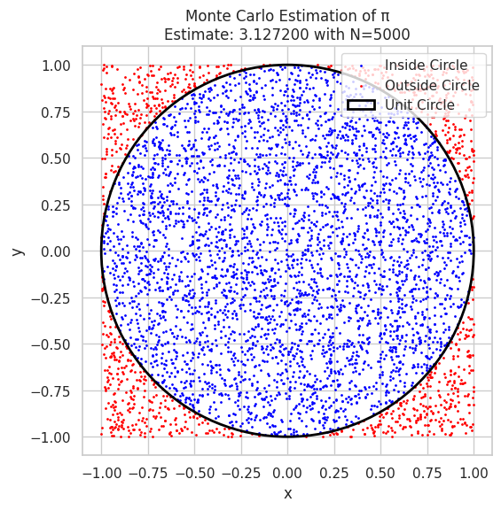
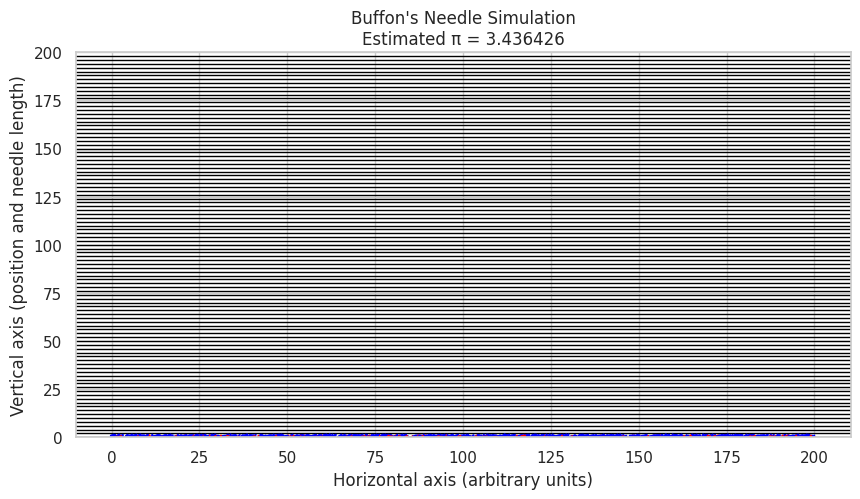

# Problem 2
# Estimating $\pi$ Using Monte Carlo Methods

---

## ✅ 1. Theoretical Foundation

### Geometric Probability Concept

Monte Carlo estimation of $\pi$ relies on **geometric probability**: randomly sampling points in a known area and using their distribution to estimate an unknown value.

We consider a **unit circle** (radius $r = 1$) centered at the origin, inscribed in a square of side length 2. That square spans from $x = -1$ to $x = 1$ and $y = -1$ to $y = 1$.

### Area Calculations

- Area of unit circle:

$$
A_{\text{circle}} = \pi r^2 = \pi
$$

- Area of bounding square:

$$
A_{\text{square}} = (2)^2 = 4
$$

### Probability Interpretation

If we generate a large number of random points uniformly within the square, the **probability** that a point lies inside the circle is:

$$
P(\text{point inside circle}) = \frac{A_{\text{circle}}}{A_{\text{square}}} = \frac{\pi}{4}
$$

### Estimating $\pi$

Rearranging the above gives an estimator for $\pi$:

$$
\pi \approx 4 \times \frac{\text{Points inside circle}}{\text{Total number of points}}
$$

---

## ✅ 2. Simulation

To simulate the estimation:

- Generate $N$ random points $(x_i, y_i)$ where:

$$
x_i, y_i \in [-1, 1]
$$

- Count the number of points that fall **inside the circle**:

$$
x_i^2 + y_i^2 \leq 1
$$

- Estimate $\pi$ as:

$$
\pi \approx 4 \cdot \frac{N_{\text{inside}}}{N_{\text{total}}}
$$

---

## ✅ 3. Visualization

To enhance interpretation:

- Plot all the randomly generated points.
  - **Use blue** for points **inside the circle**.
  - **Use red** for points **outside the circle**.
- Overlay the unit circle for reference.

Optional: Add annotations for:
- The current estimated value of $\pi$
- The total number of iterations

---

> **Note:** This method showcases how randomness can be used for deterministic estimation and is a classic example in **numerical computation, probability theory**, and **statistical physics**.

# Analysis of Monte Carlo Estimation of π

## Convergence of the Estimate

The Monte Carlo method estimates π by sampling random points and using the ratio of points inside the unit circle to the total number of points:

$$
\hat{\pi}_N = 4 \times \frac{N_{\text{inside}}}{N}
$$

where

- $N$ is the total number of sampled points,
- $N_{\text{inside}}$ is the number of points inside the unit circle.

As $N \to \infty$, by the Law of Large Numbers, the estimate $\hat{\pi}_N$ converges to the true value $\pi$:

$$
\lim_{N \to \infty} \hat{\pi}_N = \pi
$$

## Error and Convergence Rate

The standard deviation (uncertainty) in the estimate decreases with the number of points sampled. Since this is a Bernoulli trial with success probability $p = \pi/4$, the variance of the estimate is:

$$
\text{Var}(\hat{\pi}_N) = 16 \times \frac{p(1-p)}{N}
$$

and thus the standard error scales as:

$$
\text{SE}(\hat{\pi}_N) = 4 \sqrt{\frac{p(1-p)}{N}} \sim \frac{C}{\sqrt{N}}
$$

where $C$ is a constant depending on $p$. This means the convergence is proportional to $1/\sqrt{N}$ — **slow but steady**.

## Computational Cost

- The computational time scales linearly with $N$ because each point requires one evaluation to check if it lies inside the circle.
- For very large $N$, the method becomes computationally expensive but can be easily parallelized since each point's evaluation is independent.
- Visualization and memory may become bottlenecks at very large $N$.

---
Discussion Points
The plot shows that as the number of points $N$ increases, the estimate $\hat{\pi}_N$ oscillates around the true value $\pi$ but converges closer with larger $N$.

The $1/\sqrt{N}$ convergence rate means to improve accuracy by a factor of 10, you need 100 times more points.

The Monte Carlo method is simple and flexible but may not be the most computationally efficient method for extremely precise estimates.

Parallel computing or variance reduction techniques (e.g., stratified sampling) can improve efficiency.
# Part 2: Estimating π Using Buffon's Needle

## 1. Theoretical Foundation

Buffon's Needle problem is a classical example of geometric probability, where a needle of length $\ell$ is dropped onto a plane with parallel lines spaced $d$ units apart ($d > \ell$). The objective is to estimate $\pi$ based on the probability that the needle crosses one of these lines.

---

### Problem Setup:

- Parallel lines are spaced at distance $d$.
- Needle length is $\ell$.
- The needle is dropped randomly on the surface such that:
  - The center of the needle lies at a uniform random distance from the nearest line, say $x \in [0, \frac{d}{2}]$.
  - The angle $\theta$ between the needle and the lines is uniformly distributed in $[0, \pi/2]$ due to symmetry.

---

### Probability of Crossing a Line

The needle crosses a line if the projection of half its length onto the axis perpendicular to the lines is greater than the distance from the center to the nearest line:

$$
x \leq \frac{\ell}{2} \sin \theta
$$

By integrating over all possible $x$ and $\theta$, the probability $P$ that the needle crosses a line is given by:

$$
P = \frac{2 \ell}{\pi d}
$$

---

### Estimation of π

Given:

- $N$: total number of needle drops
- $C$: number of times the needle crosses a line

The probability $P$ can be approximated by:

$$
P \approx \frac{C}{N}
$$

Rearranging to estimate $\pi$ yields:

$$
\boxed{
\pi \approx \frac{2 \ell N}{d C}
}
$$

This formula forms the basis for estimating $\pi$ via the Buffon's Needle experiment.

---

## 2. Simulation

To simulate this experiment:

1. Generate $N$ needle drops.

2. For each drop:
   - Randomly choose the center position $x$ uniformly in $[0, \frac{d}{2}]$.
   - Randomly choose the needle angle $\theta$ uniformly in $[0, \pi/2]$.
   
3. Determine if the needle crosses a line by checking:

$$
x \leq \frac{\ell}{2} \sin \theta
$$

4. Count the total number of crosses $C$.

5. Estimate $\pi$ using:

$$
\pi \approx \frac{2 \ell N}{d C}
$$

---

## 3. Visualization

Create a visual diagram including:

- Parallel lines spaced by distance $d$.
- Depicted needles:
  - Needles crossing a line marked in one color (e.g., red).
  - Needles not crossing a line marked in a different color (e.g., blue).

Such a visualization aids understanding of the geometric probability underpinning Buffon's Needle problem.

---

How this works:
Randomly drops $N$ needles with random center positions and angles.

Checks which needles cross any of the parallel lines spaced by $d$.

Uses the Buffon formula to estimate $\pi$.

Visualizes the needles: red for crossing, blue otherwise.

Shows parallel lines spaced by $d$.